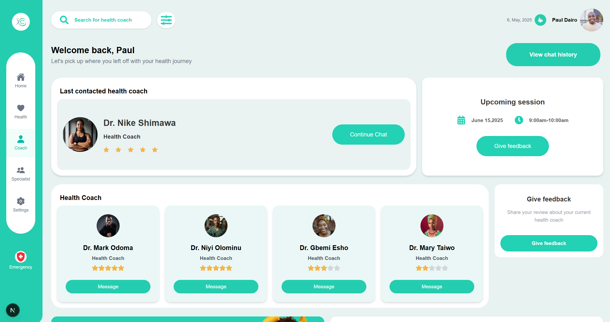

# Wellio - Frontend Project



Wellio is a health management web application designed to help users track their vital health data, manage medications, and consult trusted health experts — all in one simple platform.

---

## 📚 Table of Contents
- [Project Overview](#project-overview)
- [Features](#features)
- [Installation](#installation)
- [Project Structure](#project-structure)
- [Usage](#usage)
- [Contributors](#contributors)

---

## 🚀 Project Overview
Wellio focuses on simplifying and personalizing healthcare for individuals living with chronic conditions. The application includes features for tracking health metrics, managing medications, and accessing health coaching.

### Key Pages
- **Landing Page**: An overview of the Wellio platform.
- **Login Page**: User authentication for accessing the dashboard.
- **Dashboard Pages**:
  - **Home**: Overview of tracked health data.
  - **Coach**: Access to certified health coaches.
  - **Health**: Track vital health statistics.
  - **Specialist**: Connect with medical specialists.
  - **Settings**: Manage user preferences and account settings.

---

## ✨ Features
- User-friendly interface for health tracking.
- Mock user authentication.
- Real-time health data monitoring.
- Access to health coaches and specialists.

---

## 💻 Installation

To get started with Wellio, follow these steps:

1. **Clone the repository**:
   ```bash
   git clone https://github.com/yourusername/wellio-frontend-project.git
   ```

2. **Navigate to the project directory**:
   ```bash
   cd wellio-frontend-project
   ```

3. **Install dependencies**:
   ```bash
   npm install
   ```

4. **Run the development server**:
   ```bash
   npm run dev
   ```

5. **Open your browser and visit** `http://localhost:3000` to see the application in action.

---

## 📖 Usage
After installation, you can explore the following features:
- Sign in using the login page.
- Navigate through the dashboard to track and manage your health data.
- Consult with health coaches and specialists directly from the app.

---

## 👩‍💻 Contributors
*Mariam Deborah Raji – Frontend Development, UI/UX*  
*📧 mareeamraj@gmail.com*

*Cjay Chijioke Nnabueze – Frontend Development*  
*📧 chijiokennabueze@gmail.com*

*Anthony Igbodiegwu – Frontend Development*  
*📧 peakybeetle@gmail.com*
